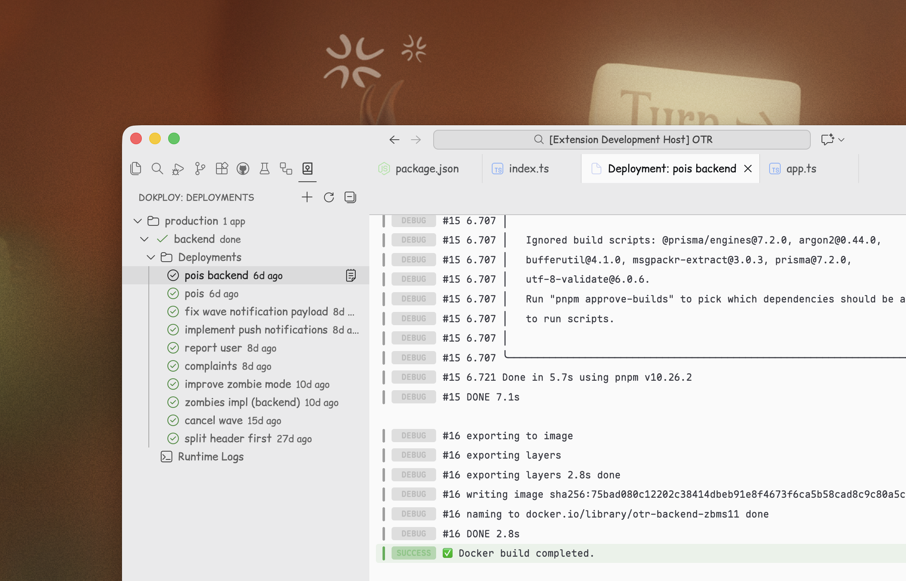

# Dokploy

Monitor [Dokploy](https://dokploy.com) deployments and logs directly in VS Code.

## Features

- **Auto-detection** — Automatically matches your workspace's Git remote to applications on your Dokploy server
- **Deployment tree view** — See all matched applications with real-time status indicators
- **Live log streaming** — View build and runtime logs with ANSI color support
- **One-click redeploy** — Trigger redeployments without leaving your editor
- **Multi-server support** — Connect to multiple Dokploy instances
- **Configurable refresh** — Auto-refresh deployment status at your preferred interval

## Getting Started

### Prerequisites

- A running [Dokploy](https://dokploy.com) server
- An API key (generate from your Dokploy dashboard)

### Setup

1. Install the extension from the VS Code Marketplace
2. Open the Command Palette (`Cmd+Shift+P` / `Ctrl+Shift+P`)
3. Run `Dokploy: Add Server`
4. Enter your server URL and API key
5. Open a Git repository that matches an application on your Dokploy server

The extension will automatically detect and display matching applications in the sidebar.

## Configuration

| Setting | Default | Description |
|---------|---------|-------------|
| `dokploy.refreshInterval` | `30` | Auto-refresh interval in seconds |

## Contributing

Issues and PRs welcome! See the [GitHub repository](https://github.com/blackmann/dokploy-vscode).

---

Built for [Dokploy](https://dokploy.com) 🚀
